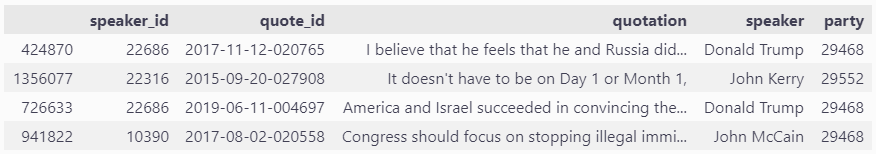
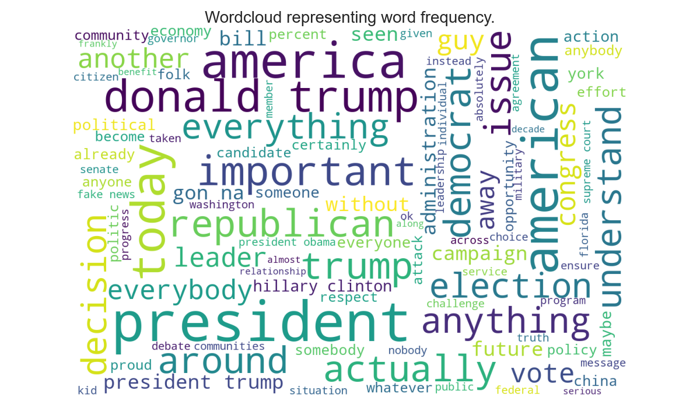

<p align="center">
  
  
  
  
  
  
  
  
  
</p>

In this project we investigated how opinions and ideas can influence the way politicians speak, what they talk about, and the way they do it, with the ultimate aim of predicting the party of a politician just by his sentences, without any prior knowledge on the speaker. Is that possible? A machine learning classifier will try to answer this question.

Since trying to answer the previous questions on a global scale would be too big of research for a single story, we decided to focus on the two most famous political parties in the world: USA’s Republican and Democratic parties. Starting from quotes of US representatives of the Democratic and Republican parties, we divide them by treated subject and perform sentiment analysis on them across time, to assess the evolution of opinions of the two groups on different matters. Pairing these results with an analysis of the lexical and syntactical properties of the sentences, we try to build a model capable of predicting the affiliations of the speaker based on his quotes.

This project was done for the EPFL course [CS-401 Applied data analysis](https://edu.epfl.ch/coursebook/en/applied-data-analysis-CS-401) (2021/2022) and most of the data was taken from [Quotebank dataset](https://zenodo.org/record/4277311#.YvDUCPjP3tU), a corpus of quotations from a decade of news.

The final results of the project were put together into a **Data-story**. You can read it by clicking [here](https://dxts.github.io/ada-2021-project-datastory/).

## Authors

- [Elia Fantini](https://github.com/EliaFantini/)
- [Maciej Styczeń](https://github.com/mstyczen)
- [Nicolo de Sabbata](https://github.com/cndesabbata)
- [Dixit Sabharwal](https://github.com/dxts)

## Data preprocessing

To perform the analysis, we are interested in selecting only the quotes from politicians and matching them with the political affiliation of the speaker.
To obtain such a dataset, we perform the following preprocessing steps:

1. Load the Quotebank dataset.
2. Drop the quotes without an attributed speaker.
3. Load the Wikidata table with metadata about the speakers and select the speakers that are affiliated with the Democratic or Republican party.
4. Perform an inner join between the table containing the quotes (Quotebank) and the table containing (Wikidata).
5. Select the subset of the data that corresponds to politicians affiliated with Democrats and Republicans that were candidates in at least one election.

In addition, we plan to use grammatical structure and complexity metrics to analyze quotes and drop the ones with outlier values, as they are likely to be meaningless quotes.

After preprocessing we have a dataset of 1.6m quotations of US politicians, associating each quote to the speaker who uttered it and his political affiliation - see an example below:



## Data analysis performed

### Area 1: Topic labeling

1. What terms/phrases characteristic of politics appear most often in the quotations? Is there a difference between the terms used by the two parties?
2. Can a classifier be constructed to automatically classify quotations to groups corresponding to topics (e.g. economy, military, environment)?
3. How do the popular topics differ between the two parties? Can the popular topics be linked to the ideologies linked to the speaker's party?
4. How does the topic's popularity evolve with time?

**Note**: Questions 3 and 4 can only be answered if we can successfully assign topics to quotations.

#### Method:

To get an initial understanding of what topics do politicians often mention, we performed a word frequency analysis. The results are visualized in the figure below:


To achieve that, we first tried to use a transfer-learning approach: train a classifier on the data obtained from the [Manifesto-Project dataset](https://manifestoproject.wzb.eu), which provides sentences of the two parties' manifestos over years 2012, 2016, and 2020, labeled manually by experts to one of fifteen different topics/categories. Unfortunately, the data was too different from ours and thus the resulting accuracy was not satisfying. 

We then proceeded with unsupervised clustering using Bertopic, a topic modeling technique that leverages transformers
and c-TF-IDF to create dense clusters allowing for easily interpretable topics whilst keeping important words in the
topic descriptions. After a quick manual preprocessing of the quotes and a preprocessing pipeline from `BERTopic` library
itself, we trained the model with a third of the dataset (0.6 million quotes), due to RAM limitations.

### Area 2: Sentiment analysis

1. Is there a difference between the fraction of quotations that are positive/negative between the two parties? What does that say about the general attitude of the party?
2. What are there topics towards which the parties have very different sentiments? Does this align with the parties' ideology?

#### Method:

Labeling the quotations as positive/negative, often referred to as sentiment analysis, introduces additional information about the emotion that is carried by the quotation. Attributing sentiment to quotations can be performed using pre-trained transformer models such as [BERT](https://arxiv.org/abs/1810.04805) or rule-based tools like `VADER-Sentiment`. The sentiment can be then computed per party/topic and the time evolution can also be analyzed.

### Area 3: Grammatical structure and complexity

1. Do speakers of the two groups use a different lexicon? Which one uses the largest vocabulary?
2. Is there any noticeable difference in the complexity of the sentences? Which one is more readable?
3. How did the grammar complexity and correctness of sentences evolve with time?

#### Method:

Utilizing the `Textstat` library we added to each quotes different readability, complexity, and grade level metrics. Thanks to these statistics we might see if there's a significant difference between speakers from different parties, as well as differences between people with identical affiliations but different backgrounds. 

### Area 4: Predicting speaker's political affiliation

1. Combining all the data from the preprocessing, enriched by sentiment analysis, topic classification, and grammatical complexity, is it possible to build a classifier that can predict whether the quoted speaker is affiliated with Republicans or Democrats?

#### Method:

Build a classifier using a CNN. Utilizing all features generated by previous analysis feature extraction, train the CNN for the classification task. Evaluate performance on a test set.

## Results 
The results of our work are presented on [our datastory website](https://dxts.github.io/ada-2021-project-datastory/). Majority of our code can be found in the `ADA_project.ipynb` Jupyter notebook, with some supporting functions present in the `src` module.

### Contributions
* Dixit: Complexity and readability analysis, set-up datastory website.
* Elia: Topic analysis, complexity and readability analysis, writing the datastory.
* Maciej: Frequency analysis, sentiment analysis, plots, some work on the datastory.
* Nicolo: Topic analysis, preliminary analysis, classifier.

## How to install and reproduce results
Download this repository as a zip file and extract it into a folder. The easiest way to run the code is to install Anaconda 3 distribution (available for Windows, macOS and Linux). To do so, follow the guidelines from the official
website (select python of version 3): https://www.anaconda.com/download/

Additional package required are: 
- matplotlib
- scipy
- jupyter notebooks
- pandas
- seaborn
- nltk
- vaderSentiment
- wordcloud
- sklearn
- pytorch

To install them write the following command on Anaconda Prompt (anaconda3):
```shell
cd *THE_FOLDER_PATH_WHERE_YOU_DOWNLOADED_AND_EXTRACTED_THIS_REPOSITORY*
```
Then write for each of the mentioned packages:
```shell
conda install *PACKAGE_NAME*
```
Some packages might require more complex installation procedures (especially [pytorch](https://pytorch.org/)). If the above command doesn't work for a package, just google "How to install *PACKAGE_NAME* on *YOUR_MACHINE'S_OS*" and follow those guides.

Finally, run the jupyter notebook **ADA_project.ipynb**. 

## Files description

- **[Datastory](https://dxts.github.io/ada-2021-project-datastory/)**: a website where we explain all the results we obtained as an easy-to-read article.

- **ADA_project.ipynb**: main file, a jupyter notebook containing all the code to rerun all the experiments and analysis.

-  **src/**: folder containing most of the code and helpers to run the analysis in *ADA_project.ipynb*. Used so that we did not overload the jupyter notebook with code, which would have make it unreadable.

- **project_manifesto_experiments/**: folder containing code and experiments on an additional dataset ([Manifesto-Project dataset](https://manifestoproject.wzb.eu)). Since the results were not meaningful, it is not part of the data-story and for this reason it's on a separate folder.

- **figures/**: folder containing the figures for the [datastory](https://dxts.github.io/ada-2021-project-datastory/).

- **data/**: folder containing a part of the data that we carefully preprocessed and put into *.txt* files. Most of the data analysis initially started on the Quotebank dataset which is very large and could not be loaded in this repository. Visit Quotebank's website for info on how to access the whole dataset.

## 🛠 Skills

Matplotlib, Pandas, Pytorch, Nltk, Seaborn, Sklearn. Big dataset manipulation with Pandas, Word frequency analysis, transfer-learning, unsupervised clustering with Bertopic, preprocessing of the quotes,
sentiment analysis with transformer models (BERT) and VADER-Sentiment, Textstat library for grammatical structure and complexity analysis, build a classifier using a CNN.
